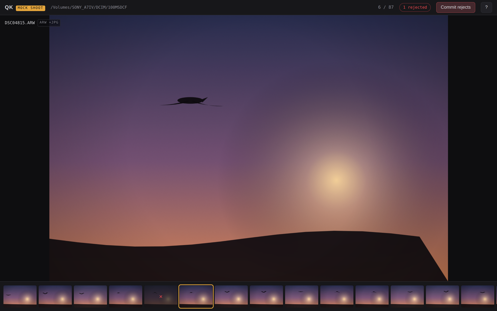
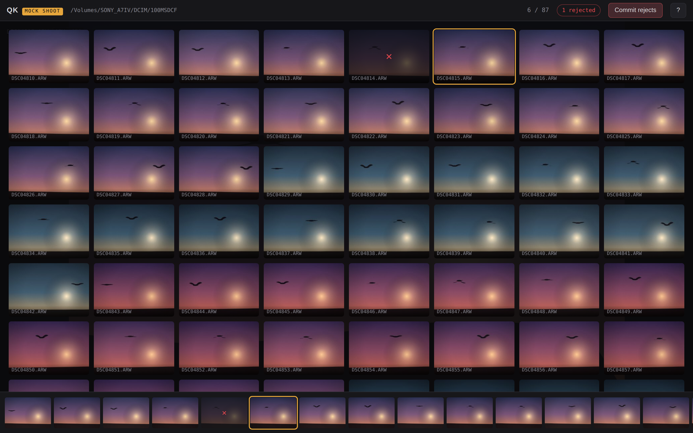
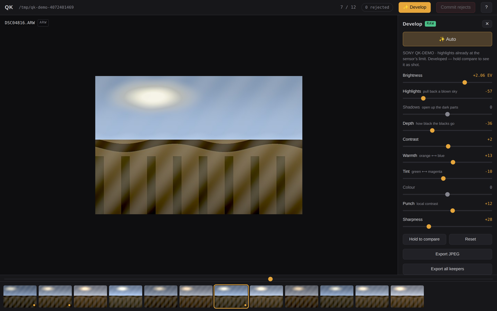
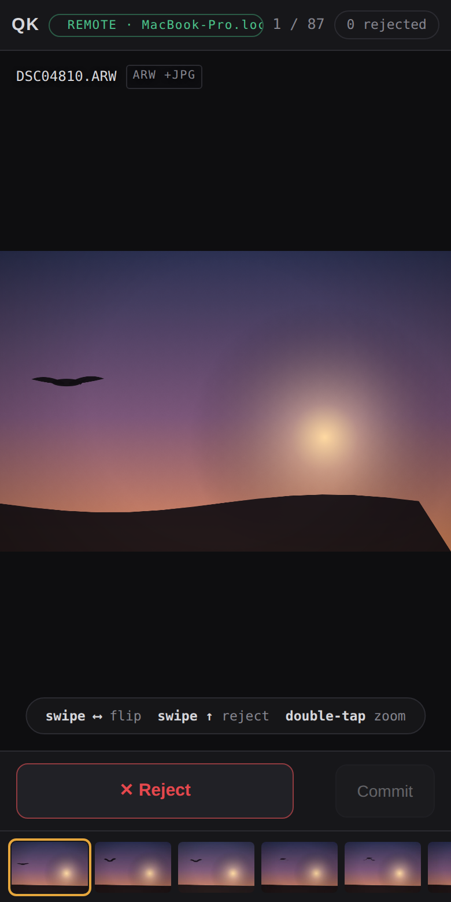

# QK

**Rip through burst photos straight off the SD card.** No import, no
catalog, no waiting for anything to load. Look at a shot, keep it or kill
it, next.



You shot 800 frames of a bird and 30 of them matter. Photos.app wants to
import everything first. Bridge wants to think about each file. QK just
opens the folder and shows you the first photo before you've let go of the
mouse — because your camera already rendered a preview of every shot, and
QK uses it instead of chewing through the RAW.

## What it does

- **Opens your card directly** — pick the folder, start culling. Sony ARW
  and JPEG, with RAW+JPEG pairs treated as one photo.
- **Flip through a burst like a flipbook** — hold `→`. The next frames are
  already loaded before you get there.
- **Zoom that stays put** — `Z` for 1:1, and it stays locked while you
  arrow between near-identical frames to see which one nailed focus.
- **Nothing is deleted by accident** — `X` marks a reject (dim, red ✕,
  fully reversible). One explicit **Commit** moves the marked pairs to the
  Trash, where they're recoverable until you empty it.
- **Grid overview** — `G` to see the whole shoot at once.



## Then make the keepers look right

Press **`E`** on a photo you kept. QK reads the actual sensor data out of
the ARW — not the JPEG your camera guessed at — looks at the histogram,
and develops it: exposure, white balance, a real black point, highlight
recovery, contrast. You don't press anything. It's just done.



Then argue with it if you like. Ten sliders, named for what they do to the
picture:

- **Highlights** pulls a blown sky back out of the white. This is the one
  that needs RAW: your camera's JPEG threw that detail away, the sensor
  didn't.
- **Depth** sets where black actually starts, which is most of what makes
  a flat photo stop looking flat.
- **Warmth** and **Tint** fix a colour cast, with the whole latitude of
  the sensor behind them instead of an 8-bit JPEG that tears when pushed.
- **Punch** is local contrast, **Sharpness** puts back what demosaicing
  costs.

Hold **Compare** to see what you started with. **`R`** puts it all back.

**Nothing is ever written to your RAW.** Edits live in a small file beside
it — copy the folder and they come along, delete it and the photo is as
shot. If the card's lock switch is on, they go to app support instead, and
you can still edit.

**⌘E** writes a full-size JPEG, developed at full resolution with a proper
demosaic and your camera, lens and location metadata carried across.
**⌘⇧E** does that for every keeper in the shoot. **⌘C** puts the photo on
the clipboard to paste straight into a message.

<sub>Sony ARW today: uncompressed and compressed. A file QK can't decode
falls back to editing the camera's preview instead of refusing — the panel
says which one you're working on, because the difference is real.</sub>

## Cull from your phone



Hit **📱 Phone**, scan the QR code, and the same session opens in your
phone's browser — swipe to flip, swipe up to reject, double-tap to zoom.
Marks sync live between phone and laptop, both can commit, and it all runs
over local Wi-Fi or a hotspot: no internet, no app to install, and nobody
without the QR code can connect.

Great for planes, couches, and anywhere you don't feel like hunching over
a trackpad.

<br clear="right">

## Keyboard

| Key | Action |
|---|---|
| `←` `→` | previous / next photo (hold to flip) |
| `X` | mark / unmark reject |
| `Z` or click | 1:1 zoom, move mouse to pan |
| `G` | grid overview |
| `E` | develop this photo |
| `A` | auto-develop · `R` reset · `\` before/after |
| `⌘E` | export a JPEG · `⌘⇧E` export every keeper |
| `⌘⏎` | commit rejects |
| `⌘O` | open a different folder |
| `?` | all shortcuts |

## Install

Paste this in Terminal — it installs (or updates) the latest release with
no security prompt, since terminal downloads skip macOS quarantine:

```sh
curl -fsSL https://raw.githubusercontent.com/shaumik/qk-photo-viewer/main/install.sh | sh
```

Works on Intel and Apple Silicon. Re-run it any time to update.

<details>
<summary>Prefer downloading by hand?</summary>

Grab `QK-macos.zip` from the [latest release](../../releases/latest) and
drag `QK.app` into Applications. Browser downloads trigger Gatekeeper
once (the app isn't code-signed): click **Done**, then
**System Settings → Privacy & Security → Open Anyway**.
</details>

Then plug in your card, open the `DCIM` folder, cull.

---

<sub>Want to poke at the code? `make ui` runs the interface in a browser
with a fake shoot, `make test` runs the backend tests. Built with Go and
Wails.</sub>
